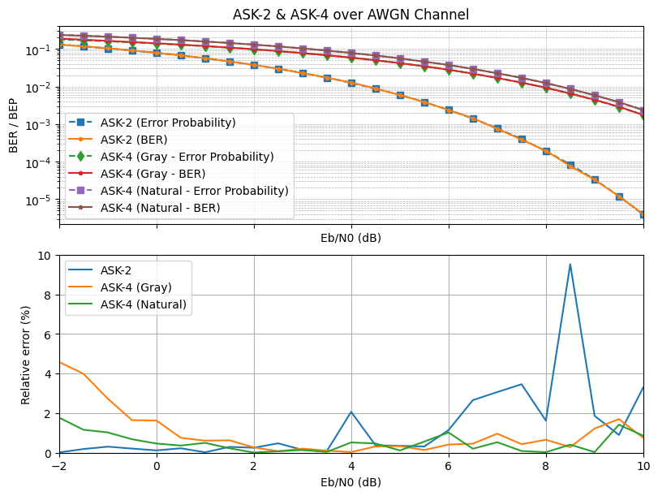

# BER Simulator

Frame-wise bit-error-rate (BER) simulator for digital communication systems.
Supports 2-ASK (BPSK) and 4-ASK (Gray or Natural mapping), AWGN/Rayleigh channels, and Uncoded or Conv(K=7, R=1/2) coders.
Implemented in multithreaded C++ with Wilson confidence-interval early stopping for accurate, efficient runs.

<p align="center">
  
</p>

## Build & Run

```bash
cd project
mkdir build && cd build
cmake ..
make -j
./ber
```

The executable reads parameters from `../config.ini` (relative to `build/`).

## Configuration

Keys are read as `section.key`. Example:

```ini
[parallel]
threads = 0 ; 0 means auto-detect and use all available cores

[rng]
seed = 0 ; 0 means random seed based on current time

[snr]
start_db = -2
stop_db  = 10
step_db  = 0.5

[stopping]
min_errors = 100
max_bits   = 1000000000
ber_floor  = 0.000001

[ci]
level    = 0.95
abs      = 0
rel      = 0.20
min_bits = 1000000

[model]
modem     = ask4_natural ; ask2, ask4_gray, ask4_natural
channel   = awgn ; awgn, rayleigh
coder     = conv_k7_r12 ; uncoded, conv_k7_r12
frame_len = 10000

[io]
file = ../ber/

```

## Output

The program saves the ber results in `project/ber/` with an auto-named CSV with header:

```
snr_db,ber,num_bits,num_errors,ci_low,ci_high
```

- `ber = num_errors / num_bits`
- `ci_low`, `ci_high` are Wilson bounds at `ci.level` (e.g., 95%).

The file name is **`<coder>_<modem>_<channel>.csv`** (e.g., `uncoded_ask4_gray_awgn.csv`).

---

## Stopping Criteria

For each SNR point, simulation stops when **any** of:

- `num_bits ≥ max_bits`
- CI half-width meets targets (absolute and/or relative) after `ci_min_bits`
- CI **upper bound** <= `ber_floor` (confidently below your floor)

Across SNRs, the sweep ends early when the current point is already <= `ber_floor`.

---

## License

This project is released under the [MIT License](LICENSE).
